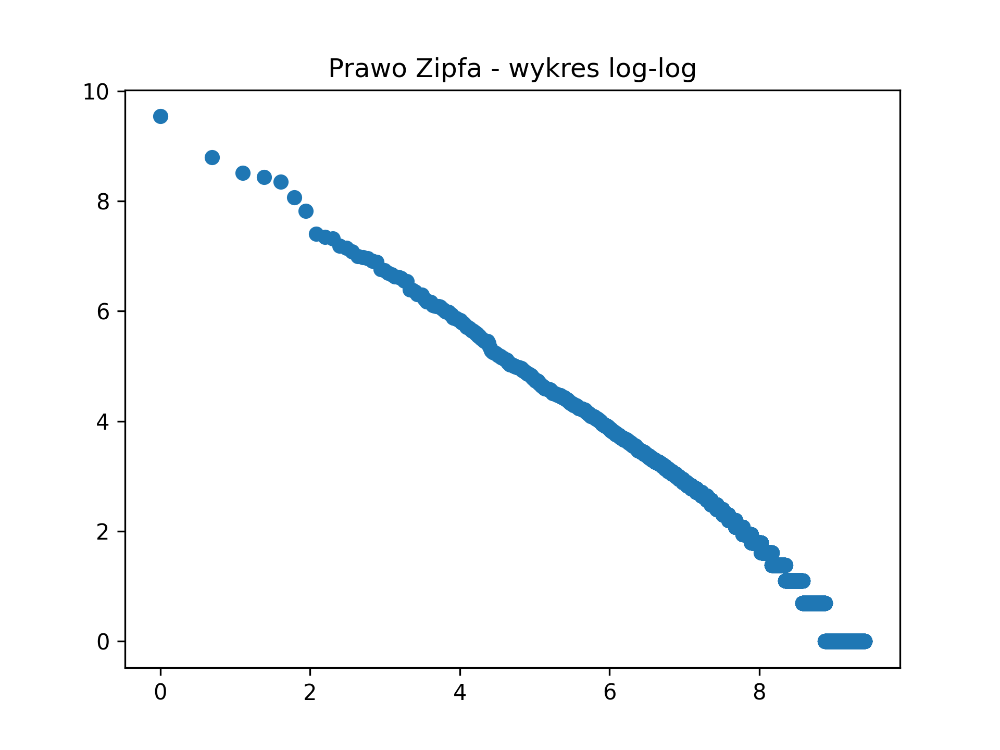

# Przetwarzanie języka naturalnego

# Analiza Prawa Zipfa w Korpusie Języka Angielskiego

# Opis projektu

Celem projektu było:

1. Zbudowanie korpusu tekstowego (~100 000 słów)
2. Obliczenie częstości słów
3. Sprawdzenie zgodności z prawem Zipfa
4. Wyznaczenie:
   - pokrycia 90% tekstu
   - rdzenia języka

---

# Tokenizacja i przygotowanie danych

Teksty zostały:

- zamienione na małe litery
- oczyszczone ze znaków specjalnych
- zachowano apostrofy wewnątrz słów (np. `it's`, `don't`) aby nie generować sztucznych tokenów takich jak s albo t
- przekształcone do listy tokenów

**Rozmiar korpusu:**

- Liczba wszystkich tokenów: `164776`
- Liczba unikalnych słów: `12201`

---

# Tabela częstości i wynik Zipfa

Dla każdego słowa obliczono:

- liczbę wystąpień
- rangę
- wartość `ranga × częstość` 

### Wynikowa tabela:

| word   |   counts |   rank |   zipf_score |
|:-------|---------:|-------:|-------------:|
| the    |    13923 |      1 |        13923 |
| of     |     6633 |      2 |        13266 |
| a      |     4974 |      3 |        14922 |
| and    |     4599 |      4 |        18396 |
| to     |     4234 |      5 |        21170 |
| in     |     3192 |      6 |        19152 |
| is     |     2501 |      7 |        17507 |
| it     |     1647 |      8 |        13176 |
| that   |     1555 |      9 |        13995 |
| be     |     1509 |     10 |        15090 |
| with   |     1316 |     11 |        14476 |
| as     |     1277 |     12 |        15324 |
| on     |     1193 |     13 |        15509 |
| at     |     1098 |     14 |        15372 |
| or     |     1072 |     15 |        16080 |
| by     |     1055 |     16 |        16880 |
| for    |     1004 |     17 |        17068 |
| which  |      987 |     18 |        17766 |
| are    |      865 |     19 |        16435 |
| from   |      845 |     20 |        16900 |
| he     |      807 |     21 |        16947 |
| one    |      785 |     22 |        17270 |
| his    |      758 |     23 |        17434 |
| was    |      746 |     24 |        17904 |
| this   |      738 |     25 |        18450 |
| an     |      704 |     26 |        18304 |
| her    |      695 |     27 |        18765 |
| you    |      595 |     28 |        16660 |
| had    |      592 |     29 |        17168 |
| not    |      575 |     30 |        17250 |
| if     |      549 |     31 |        17019 |
| but    |      542 |     32 |        17344 |
| have   |      541 |     33 |        17853 |
| fig    |      504 |     34 |        17136 |
| when   |      480 |     35 |        16800 |
| she    |      479 |     36 |        17244 |
| so     |      474 |     37 |        17538 |
| will   |      447 |     38 |        16986 |
| other  |      446 |     39 |        17394 |
| its    |      441 |     40 |        17640 |

Jeśli prawo Zipfa jest spełnione, iloczyn `ranga × częstość` powinien być zbliżony do stałej wartości.

---

# Wykres log-log

Aby sprawdzić liniowość rozkładu, wykonano wykres:

`log(rank)` vs `log(freq)`

Jeśli prawo Zipfa obowiązuje, punkty powinny układać się w linię prostą.

**Wniosek:**  
Rozkład wykazuje niemal liniową zależność w skali log-log, co potwierdza zgodność z prawem Zipfa.  
Odchylenia widoczne są na krańcach przedziału co jest normalne dla analizy rzeczywistych korpusów językowych.

---

# 90% Pokrycia Tekstu

Obliczono, ile najczęstszych słów odpowiada za 90% wszystkich wystąpień.

Wynik:

- `3194` najczęstszych słów pokrywa 90% tekstu.

To pokazuje silną nierównomierność rozkładu słownictwa — niewielka część słów dominuje w komunikacji.

---

# Rdzeń języka

Rdzeń języka został zdefiniowany jako:

> 20–50 słów o największej liczbie unikalnych sąsiadów.

Dla każdego słowa policzono:
- liczbę różnych słów występujących przed nim
- liczbę różnych słów występujących po nim
- sumę unikalnych sąsiadów

### Top 50 słów tworzących rdzeń języka:
|słowo | sąsiedzi |
|:-------|---------:|
|the | 4752 |
|and | 3550 |
|of | 3207 |
|a | 2555 |
|to | 2178 |
|in | 1949 |
|is | 1450 |
|or | 1097 |
|that | 1056 |
|it | 1003 |
|with | 988 |
|for | 924 |
|on | 883 |
|as | 873 |
|by | 866 |
|at | 831 |
|which | 755 |
|be | 733 |
|are | 729 |
|his | 704 |
|from | 650 |
|her | 610 |
|he | 603 |
|was | 585 |
|an | 582 |
|but | 576 |
|this | 558 |
|one | 540 |
|its | 467 |
|had | 465 |
|so | 450 |
|when | 426 |
|she | 399 |
|if | 397 |
|has | 375 |
|not | 373 |
|you | 367 |
|into | 365 |
|their | 362 |
|have | 355 |
|will | 336 |
|two | 326 |
|would | 325 |
|i | 323 |
|all | 316 |
|out | 315 |
|we | 314 |
|were | 314 |
|may | 311 |
|they | 308 |

Charakterystyka rdzenia:

- dominują słowa funkcyjne (`the`, `and`, `of`,`a`, `to`, `in`)
- występują także czasowniki ogólnego zastosowania (`is`, `was`, `have`)
- są to słowa łączące strukturę języka

---

# Interpretacja wyników

## 1️ Czy Prawo Zipfa działa?

Tak — rozkład częstości wyraźnie wykazuje zależność odwrotnej proporcjonalności między rangą a częstością.

## 2 Czy wykres log-log jest liniowy?

W dużym zakresie — tak.  
Widoczne są typowe odchylenia w ekstremach rozkładu.

## 3 Co mówi 90% pokrycia?

Stosunkowo niewielki zbiór słów wystarcza do pokrycia zdecydowanej większości tekstu.  
Język jest silnie zoptymalizowany pod kątem efektywności komunikacyjnej.

## 4 Czy istnieje rdzeń języka?

Tak.  
Można wyodrębnić niewielką grupę słów o bardzo wysokiej centralności w grafie sąsiedztwa.

---

# Technologie

- Python
- Jupyter Notebook
- matplotlib
- collections.Counter
- analiza grafowa (neighbor degree)

---

# Autorzy

Filip Duda, Mateusz Działowski

